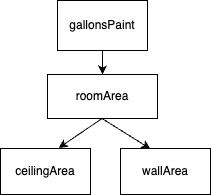

Assume a gallon of paint covers 350 square feet and that the store
only sells paint by the gallon (i.e. no 1/2 gallons available for purchase).

 

| Test Cases                     | Expected Result | Expected Call              |
|--------------------------------|-----------------|----------------------------|
| gallonsPaint(12.0, 15.0, 10.0) | 3               | roomArea(12.0, 15.0, 10.0) |
| gallonsPaint(7.5, 11.5, 8.25)  | 2               | roomArea(7.5, 11.5, 8.25)  |

- Add a new method named `gallonsPaint` to calculate the gallons of paint
  required to paint the ceiling and four walls. The method
  should return the number of gallons **rounded up** to the nearest integer.
  The `gallonsPaint` method should directly call the `roomArea` method to get the square footage of space to paint,
  then calculate the number of gallons needed to cover that area.
    

    Algorithm: 
    (1) Call <code>roomArea</code> method to get the square footage as a double 
    (2) Divide the square footage by 350.0 to get the number of gallons as a double 
    (3) Call <code>Math.ceil</code> to round the number of gallons up to the nearest double value equivalent to an integer 
    (4) Cast the double value returned from <code>Math.ceil</code> as an int 
    (5) Return the number of gallons as an int

  Feel free to introduce one or more local variables to store intermediate values during the calculation.
    

- Edit `main` to print the result of calling `roomArea` for each test case listed.
- Set a breakpoint in the `main` method and use the debugger to step into the method calls.
- Run the program and confirm the expected result.
- Check your solution to proceed to the next task.