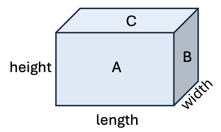

A room has four walls that need to be painted:
- The front wall (face A) and back wall (not shown) each have an area of `length x height`.
- The right wall (face B) and left wall (not shown) each have an area of `width x height`.

| Test Cases                | Expected | 
|---------------------------|----------| 
| wallArea(12.0, 15.0, 10.0)  | 540.0    | 
| wallArea(7.5, 11.5, 8.25) | 313.5    |

- Replace `???` with a new method named `wallArea` to compute the total area of the four walls given the room length, width, and height.
  Use the Javadoc comment as a guideline for parameter and return types.
- Run the program and confirm the expected result.
- Check your solution to proceed to the next task.
